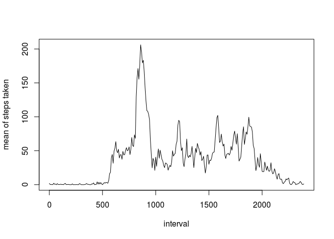
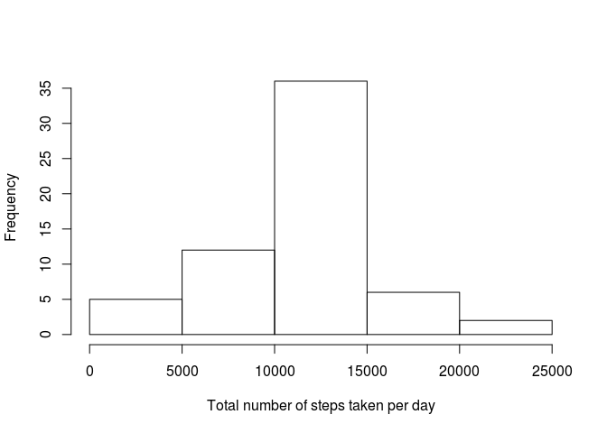
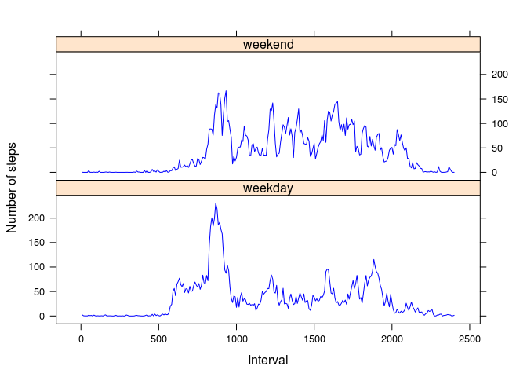

# Reproducible Research: Peer Assessment 1


## Loading and preprocessing the data
This is the code for loading the data.

```r
data <-read.csv("activity.csv")
```

This is the code for processing the data.

```r
library(plyr);library(dplyr)
```

```
## 
## Attaching package: 'dplyr'
```

```
## The following objects are masked from 'package:plyr':
## 
##     arrange, count, desc, failwith, id, mutate, rename, summarise,
##     summarize
```

```
## The following objects are masked from 'package:stats':
## 
##     filter, lag
```

```
## The following objects are masked from 'package:base':
## 
##     intersect, setdiff, setequal, union
```

```r
library(tidyr)
dat <-spread(data,interval,steps)
row.names(dat) <- dat[,1]
dat$date <- NULL
```


## What is mean total number of steps taken per day?
This is sum, mean and median of steps taken each day.

```r
dat2 <- dat
dat2$sum <- apply(dat,1,sum)
dat2$mean <- apply(dat,1,mean)
dat2$median <- apply(dat,1,median)
dat2[,which(names(dat2)=="sum"|names(dat2)=="mean"|names(dat2)=="median")]
```

```
##              sum       mean median
## 2012-10-01    NA         NA     NA
## 2012-10-02   126  0.4375000      0
## 2012-10-03 11352 39.4166667      0
## 2012-10-04 12116 42.0694444      0
## 2012-10-05 13294 46.1597222      0
## 2012-10-06 15420 53.5416667      0
## 2012-10-07 11015 38.2465278      0
## 2012-10-08    NA         NA     NA
## 2012-10-09 12811 44.4826389      0
## 2012-10-10  9900 34.3750000      0
## 2012-10-11 10304 35.7777778      0
## 2012-10-12 17382 60.3541667      0
## 2012-10-13 12426 43.1458333      0
## 2012-10-14 15098 52.4236111      0
## 2012-10-15 10139 35.2048611      0
## 2012-10-16 15084 52.3750000      0
## 2012-10-17 13452 46.7083333      0
## 2012-10-18 10056 34.9166667      0
## 2012-10-19 11829 41.0729167      0
## 2012-10-20 10395 36.0937500      0
## 2012-10-21  8821 30.6284722      0
## 2012-10-22 13460 46.7361111      0
## 2012-10-23  8918 30.9652778      0
## 2012-10-24  8355 29.0104167      0
## 2012-10-25  2492  8.6527778      0
## 2012-10-26  6778 23.5347222      0
## 2012-10-27 10119 35.1354167      0
## 2012-10-28 11458 39.7847222      0
## 2012-10-29  5018 17.4236111      0
## 2012-10-30  9819 34.0937500      0
## 2012-10-31 15414 53.5208333      0
## 2012-11-01    NA         NA     NA
## 2012-11-02 10600 36.8055556      0
## 2012-11-03 10571 36.7048611      0
## 2012-11-04    NA         NA     NA
## 2012-11-05 10439 36.2465278      0
## 2012-11-06  8334 28.9375000      0
## 2012-11-07 12883 44.7326389      0
## 2012-11-08  3219 11.1770833      0
## 2012-11-09    NA         NA     NA
## 2012-11-10    NA         NA     NA
## 2012-11-11 12608 43.7777778      0
## 2012-11-12 10765 37.3784722      0
## 2012-11-13  7336 25.4722222      0
## 2012-11-14    NA         NA     NA
## 2012-11-15    41  0.1423611      0
## 2012-11-16  5441 18.8923611      0
## 2012-11-17 14339 49.7881944      0
## 2012-11-18 15110 52.4652778      0
## 2012-11-19  8841 30.6979167      0
## 2012-11-20  4472 15.5277778      0
## 2012-11-21 12787 44.3993056      0
## 2012-11-22 20427 70.9270833      0
## 2012-11-23 21194 73.5902778      0
## 2012-11-24 14478 50.2708333      0
## 2012-11-25 11834 41.0902778      0
## 2012-11-26 11162 38.7569444      0
## 2012-11-27 13646 47.3819444      0
## 2012-11-28 10183 35.3576389      0
## 2012-11-29  7047 24.4687500      0
## 2012-11-30    NA         NA     NA
```


## What is the average daily activity pattern?
The time series plot of the 5-minute interval (x-axis) and the average number of steps taken, averaged across all days (y-axis)

```r
dat3 <- data.frame(t(dat))
rownames(dat3) <- names(dat)
names(dat3) <- rownames(dat)
dat3$mean <- apply(dat3,1,function (x) {mean(x,na.rm=TRUE)})
plot(x=(0:287)*25/3, y=dat3$mean, type="l",xlab="interval",ylab="mean of steps taken")
```

<!-- -->

The 5-minute interval, on average across all the days in the dataset, contains the maximum number of steps.

```r
as.numeric(rownames(dat3)[which(dat3$mean==max(dat3$mean))])
```

```
## [1] 835
```


## Imputing missing values
The number of days with missing data

```r
missing <- which(is.na(dat[,1]))
sum(is.na(dat[,1]))
```

```
## [1] 8
```

Let's fill the missing data with mean of respective 5 minutes interval.

```r
new_dat <- dat
new_dat[missing,] <- rep(dat3$mean,each=length(missing))
```

This is the histogram of the total number of steps taken each day from the new data set.

```r
new_dat2 <- new_dat
new_dat2$sum <- apply(new_dat,1,sum)
hist(new_dat2$sum, xlab="Total number of steps taken per day", main="")
```

<!-- -->

This is mean and median of steps taken each day from the new data set.

```r
new_dat2$mean <- apply(new_dat,1,mean)
new_dat2$median <- apply(new_dat,1,median)
new_dat2[,which(names(new_dat2)=="mean"|names(new_dat2)=="median")]
```

```
##                  mean   median
## 2012-10-01 37.3825996 34.11321
## 2012-10-02  0.4375000  0.00000
## 2012-10-03 39.4166667  0.00000
## 2012-10-04 42.0694444  0.00000
## 2012-10-05 46.1597222  0.00000
## 2012-10-06 53.5416667  0.00000
## 2012-10-07 38.2465278  0.00000
## 2012-10-08 37.3825996 34.11321
## 2012-10-09 44.4826389  0.00000
## 2012-10-10 34.3750000  0.00000
## 2012-10-11 35.7777778  0.00000
## 2012-10-12 60.3541667  0.00000
## 2012-10-13 43.1458333  0.00000
## 2012-10-14 52.4236111  0.00000
## 2012-10-15 35.2048611  0.00000
## 2012-10-16 52.3750000  0.00000
## 2012-10-17 46.7083333  0.00000
## 2012-10-18 34.9166667  0.00000
## 2012-10-19 41.0729167  0.00000
## 2012-10-20 36.0937500  0.00000
## 2012-10-21 30.6284722  0.00000
## 2012-10-22 46.7361111  0.00000
## 2012-10-23 30.9652778  0.00000
## 2012-10-24 29.0104167  0.00000
## 2012-10-25  8.6527778  0.00000
## 2012-10-26 23.5347222  0.00000
## 2012-10-27 35.1354167  0.00000
## 2012-10-28 39.7847222  0.00000
## 2012-10-29 17.4236111  0.00000
## 2012-10-30 34.0937500  0.00000
## 2012-10-31 53.5208333  0.00000
## 2012-11-01 37.3825996 34.11321
## 2012-11-02 36.8055556  0.00000
## 2012-11-03 36.7048611  0.00000
## 2012-11-04 37.3825996 34.11321
## 2012-11-05 36.2465278  0.00000
## 2012-11-06 28.9375000  0.00000
## 2012-11-07 44.7326389  0.00000
## 2012-11-08 11.1770833  0.00000
## 2012-11-09 37.3825996 34.11321
## 2012-11-10 37.3825996 34.11321
## 2012-11-11 43.7777778  0.00000
## 2012-11-12 37.3784722  0.00000
## 2012-11-13 25.4722222  0.00000
## 2012-11-14 37.3825996 34.11321
## 2012-11-15  0.1423611  0.00000
## 2012-11-16 18.8923611  0.00000
## 2012-11-17 49.7881944  0.00000
## 2012-11-18 52.4652778  0.00000
## 2012-11-19 30.6979167  0.00000
## 2012-11-20 15.5277778  0.00000
## 2012-11-21 44.3993056  0.00000
## 2012-11-22 70.9270833  0.00000
## 2012-11-23 73.5902778  0.00000
## 2012-11-24 50.2708333  0.00000
## 2012-11-25 41.0902778  0.00000
## 2012-11-26 38.7569444  0.00000
## 2012-11-27 47.3819444  0.00000
## 2012-11-28 35.3576389  0.00000
## 2012-11-29 24.4687500  0.00000
## 2012-11-30 37.3825996 34.11321
```

Because of the way we fill the missing data, the mean and median for the previously missing day is all the same. And medians for the new data are no longer all zero.


## Are there differences in activity patterns between weekdays and weekends?

```r
library(lattice)
new_dat3 <- new_dat
new_dat3$factor <- rep(c(rep("weekday",5),rep("weekend",2)),length.out=61)


new_dat_wd<- data.frame(t(subset(new_dat3, factor == "weekday",select = -factor)))
new_dat_we<- data.frame(t(subset(new_dat3, factor == "weekend",select = -factor)))
new_dat_wd$mean <- apply(new_dat_wd,1,mean)
new_dat_we$mean <- apply(new_dat_we,1,mean)

new_dat4 <- aggregate(new_dat3[,-289],by=list(new_dat3$factor),mean)
names(new_dat4)[1] <- "factor"

new_dat5 <- data.frame(cbind(y=c(new_dat4[1,2:289],new_dat4[2,2:289]),factor=rep(c("weekday","weekend"),each=288),x=1:288))
new_dat5$y<-unlist(new_dat5$y)
new_dat5$x<-unlist(new_dat5$x)*25/3
new_dat5$factor<-unlist(new_dat5$factor)
xyplot(y~x|factor,type="l",data=new_dat5,col="blue",layout=c(1,2),ylab="Number of steps",xlab="Interval")
```

<!-- -->
